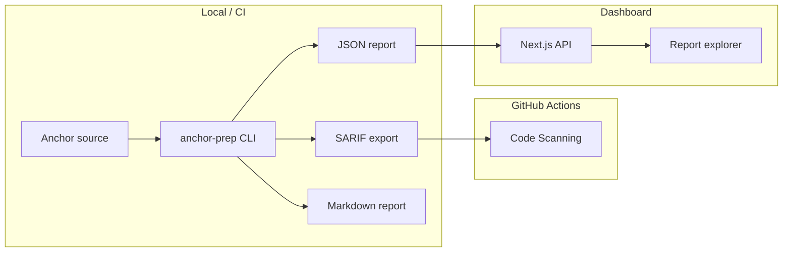

<p align="center">
  
</p>

<h1 align="center">Anchor Security Prep</h1>

<p align="center">
  <strong>Pre-audit static analysis for Anchor and Solana programs.</strong><br />
  Catch exploit-class bugs before audit or mainnet — open source, CI-ready, SARIF-native.
</p>

<p align="center">
  <a href="https://github.com/panagot/Anchor-Security-Prep/blob/main/LICENSE"></a>
  <a href="https://github.com/panagot/Anchor-Security-Prep"></a>
  <a href="https://github.com/panagot/Anchor-Security-Prep"></a>
  <a href="https://github.com/panagot/Anchor-Security-Prep"></a>
</p>

<p align="center">
  <a href="#quick-start">Quick Start</a> ·
  <a href="#web-dashboard">Dashboard</a> ·
  <a href="#rules">Rules</a> ·
  <a href="#ci-integration">CI</a> ·
  <a href="docs/GRANT.md">Grant</a> ·
  <a href="docs/APPLICATION.md">Apply</a>
</p>

---

## Overview

**Anchor Security Prep** (`anchor-prep`) is a public-good developer tool that scans Anchor program source code for common Solana exploit patterns — missing signers, unsafe CPI, PDA issues, token constraint bugs, admin exposure, and more.

It is designed for developers who need **audit-grade signal without audit-grade cost**: indie builders, hackathon teams, and early-stage protocols preparing for their first security review.

| | |
|---|---|
| **Problem** | Professional Solana audits cost $15K–$100K+. Most teams ship without pre-audit checks. |
| **Solution** | 26 Anchor-native static rules with fix guidance, SARIF export, and GitHub Actions integration. |
| **Complements** | [STRIDE](https://solana.org/grants-funding) and audit subsidies — catches issues *before* you apply. |

---

## Features

| Capability | Description |
|------------|-------------|
| **26 security rules** | Signers, PDAs, CPI, tokens, DoS, admin, Token-2022, remaining accounts |
| **Rust CLI** | Fast local scans with configurable severity gates |
| **SARIF 2.1 export** | Native GitHub Code Scanning integration |
| **GitHub Actions** | One-command CI scaffold via `anchor-prep init` |
| **Web dashboard** | Interactive report explorer with filterable findings and code context |
| **Rule documentation** | Per-rule pages with vulnerable vs hardened patterns |
| **Regression fixtures** | 21/26 golden tests (24 Rust tests; M1 target: all 26) |

---

## Quick Start

### Prerequisites

- [Rust](https://rustup.rs/) 1.70+
- [Node.js](https://nodejs.org/) 18+ (dashboard only)

### Install & scan

```bash
git clone https://github.com/panagot/Anchor-Security-Prep.git
cd Anchor-Security-Prep

# Build the CLI
cargo build -p anchor-prep

# Scan the bundled vulnerable example (40+ findings)
cargo run -p anchor-prep -- scan examples/vulnerable-program --format all

# Scan the hardened reference (0 high/critical)
cargo run -p anchor-prep -- scan examples/clean-program --format all

# List all rules
cargo run -p anchor-prep -- rules --json

# Scaffold GitHub Actions workflow
cargo run -p anchor-prep -- init
```

Reports are written to the output directory as `report.json`, `report.md`, and `report.sarif`.

### Example output

```
Report ID: 0297f326-187e-4fec-8cd9-4b7406759ea8
Project:   examples/vulnerable-program
Findings:  41 total · 29 high/critical
Rules run: 26
Formats:   reports/report.json · report.md · report.sarif
```

---

## CLI reference

| Command | Description |
|---------|-------------|
| `scan <path>` | Analyze an Anchor workspace |
| `rules [--json]` | List all rules with metadata |
| `rule <id>` | Show details for a single rule |
| `init [path]` | Scaffold `.github/workflows/anchor-prep.yml` |
| `doctor [path]` | Verify project layout and toolchain |
| `baseline save <path>` | Save finding snapshot for diffing |
| `baseline diff <path>` | Fail on new findings vs baseline |
| `audit-prep <path>` | Generate pre-audit checklist |
| `fix <id> [--dry-run]` | Print fix guidance for a rule |

**Scan flags:** `--format json|md|sarif|all` · `--out <dir>` · `--fail-on critical|high|medium|low`

---

## Web dashboard

Interactive report explorer built with Next.js 15.

```bash
npm install
npm run dev
# → http://localhost:3001
```

| Route | Purpose |
|-------|---------|
| `/` | Overview and grant demo walkthrough |
| `/compare` | Side-by-side vulnerable vs clean analysis |
| `/scan` | Run live scans against local paths |
| `/rules` | Searchable rule catalog |
| `/rules/asp001` | Per-rule documentation |
| `/report/[id]` | Finding explorer with export |
| `/integrations` | CI and CLI setup snippets |

### Deploy to Vercel

**Live demo:** [anchor-security-prep.vercel.app](https://anchor-security-prep.vercel.app)

**Demo impact:** 41 findings on vulnerable example (7 critical, 22 high) · 0 high/critical on clean reference — see [/compare](https://anchor-security-prep.vercel.app/compare)

1. Import [panagot/Anchor-Security-Prep](https://github.com/panagot/Anchor-Security-Prep) at [vercel.com/new](https://vercel.com/new)
2. Leave **Root Directory** empty (repo root — default)
3. Leave Build Command and Output Directory **empty** (defaults)
4. Deploy

> **404 fix:** See [docs/VERCEL.md](docs/VERCEL.md) — if Root Directory is set to `web`, clear it and redeploy.

The hosted demo serves bundled sample reports — no CLI required for `/compare` and `/rules`.

---

## CI integration

`anchor-prep init` creates a GitHub Actions workflow:

```yaml
- name: Run security scan
  run: cargo run --release -p anchor-prep -- scan . --format all --fail-on high

- name: Upload SARIF
  uses: github/codeql-action/upload-sarif@v3
  with:
    sarif_file: reports/report.sarif
```

A composite action is also available at [`.github/action/action.yml`](.github/action/action.yml).

---

## Rules

26 static checks mapped to real Solana exploit classes:

| Category | Rules | Examples |
|----------|-------|---------|
| Account validation | ASP001–ASP010, ASP026 | Missing signer, unchecked AccountInfo, PDA bump |
| CPI & programs | ASP006, ASP019, ASP025 | Unvalidated CPI, invoke_signed, remaining accounts |
| Token & SPL | ASP009, ASP018, ASP022, ASP024 | Mint constraints, Token-2022, ATA binding |
| Lifecycle & admin | ASP004, ASP011, ASP015 | Unsafe close, init_if_needed, admin exposure |
| Logic & DoS | ASP016, ASP017, ASP021, ASP023 | Unbounded Vec, handler loops, unchecked math |

Full catalog: run `anchor-prep rules --json` or visit `/rules` in the dashboard.

Each rule with a fixture is tested in CI; all rules are documented at `/rules/[id]`.

---

## Architecture



```
Anchor-Security-Prep/
├── app/                  # Next.js dashboard (Vercel deploy root)
├── components/
├── cli/                  # Rust scanner (anchor-prep binary)
├── public/
├── examples/
│   ├── vulnerable-program/
│   └── clean-program/
├── fixtures/             # Per-rule regression snippets
├── templates/            # GitHub Action workflow template
└── docs/
```

---

## Development

```bash
# Run all tests (fixtures + integration)
cargo test -p anchor-prep

# Build web dashboard
npm run build

# Regenerate bundled rules
cargo run -p anchor-prep -- rules --json > public/rules.json
```

---

## Grant

This project is developed as a public good for the Solana ecosystem, aligned with the [Solana Foundation Developer Tooling grant](https://solana.org/grants-funding) program.

See [docs/GRANT.md](docs/GRANT.md) for milestones, budget breakdown, and adoption targets.

**Grant application draft:** [docs/APPLICATION.md](docs/APPLICATION.md) · **Benchmark:** [docs/BENCHMARK.md](docs/BENCHMARK.md) · **Exploit mapping:** [docs/EXPLOITS.md](docs/EXPLOITS.md)

---

## License

MIT © Anchor Security Prep Contributors. See [LICENSE](LICENSE).

---

<p align="center">
  <a href="https://github.com/panagot/Anchor-Security-Prep">GitHub</a> ·
  <a href="docs/GRANT.md">Grant proposal</a> ·
  <a href="docs/schema.md">Report schema</a>
</p>
